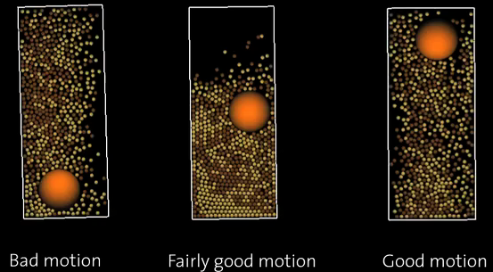

<h1>Introduction</h1>

<pre>
c++ -O2 main.cpp -lglut -lGL
</pre>

or
<pre>
c++ -O2 main.cpp -lglut `pkg-config --libs gl`
</pre>

Run
<pre>
./a.out 1 8 3
./a.out 1 8 3 saveimages
</pre>

<h1>References</h1>

<a href="https://en.wikipedia.org/wiki/Granular_convection">wikipedia:Granular_convection</a>
