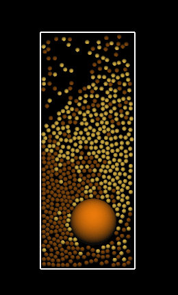

<h2>Introduction</h2>

Needs the OpenGL Utility Toolkit (GLUT) library. On Debian-based
systems, you can install it using:
<pre>
sudo apt install freeglut3-dev
</pre>

To compile:
<pre>
c++ -O2 main.cpp -lglut -lGL
</pre>
or
<pre>
c++ -O2 main.cpp -lglut `pkg-config --libs --cflags gl`
</pre>

Run:
<pre>
./a.out 1 8 3
</pre>

run and save simulation images:
<pre>
./a.out 1 8 3 saveimages
</pre>

<h2>References</h2>

<a href="https://en.wikipedia.org/wiki/Granular_convection">wikipedia:Granular_convection</a>

<h2>Method</h2>

a collision step between two particles 
 
INPUT: dt, radius, relative position r, v1, v2, omega1, omega2 are the
velocities and angular velocities of the two colliding particles 
 
OUTPUT: force1, force2, torque1, torque2

<h2>Results</h2>

